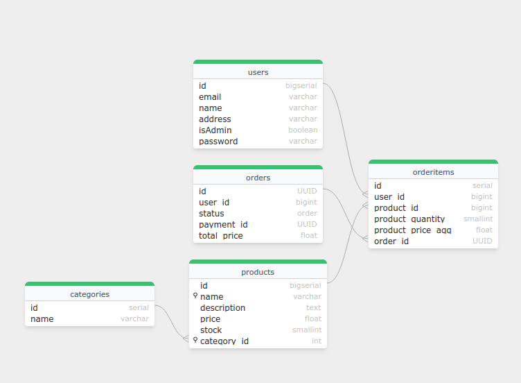

## Ecommerce Monolith Backend

Implemented using go-fiber, postgres and sqlc.

### Application Structure

- The first `db/` contains all the SQL queries with `/migration/` including the db migration
and `/queries/` having all the required SQL queries used in this application.

- `cmd/` contains the entry point of the application

- `pkg/` contains the application code which is further divided into `/controllers/`, `/services/` and 
`/repositories/` as per the MVC pattern.
- `internal/` is used for utilities like finding the unique elements in a slice, implementing a simplistic DI mechanism, handling JWT, etc.

### DB E-R diagram




### Deployment

First build the fiber application

```shell
docker compose build fiber-application
```

Then the postgres container is put up

```shell 
docker compose up db
```

Then the fiber container is put up

```shell 
docker compose up fiber-application
```

### Endpoints

1. `POST api/v1/admin/products` - To add products.
2. `DELETE api/v1/admin/products` - To delete products based on id
3. `POST api/v1/admin/categories` - To add categories.
4. `GET api/v1/admin/orders` - To get all the orders based on id and status
5. `POST api/v1/login` - To login
6. `POST api/v1/register` - To signup
7. `GET api/v1/profile` - To get the current user and all his orders
8. `GET api/v1/products` - To get the default list of products
9. `GET api/v1/products/search` - To search products based on name and category id
10. `GET api/v1/cart` - To get the current order, with the product id and total cost
11. `POST api/v1/cart` - To add items to cart
12. `POST api/v1/checkout` - To checkout items in cart
